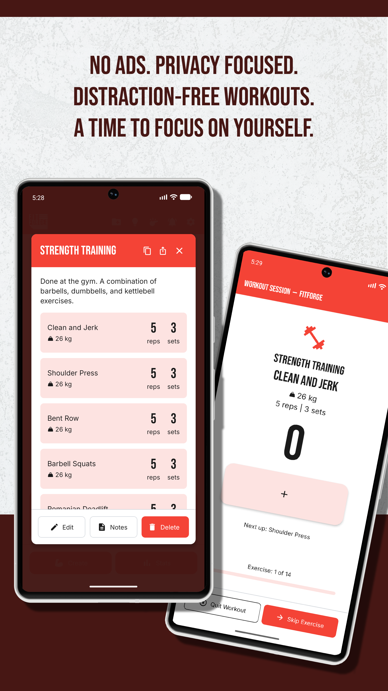
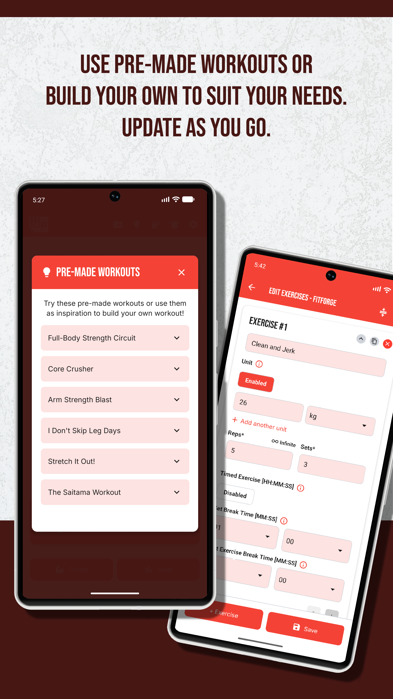
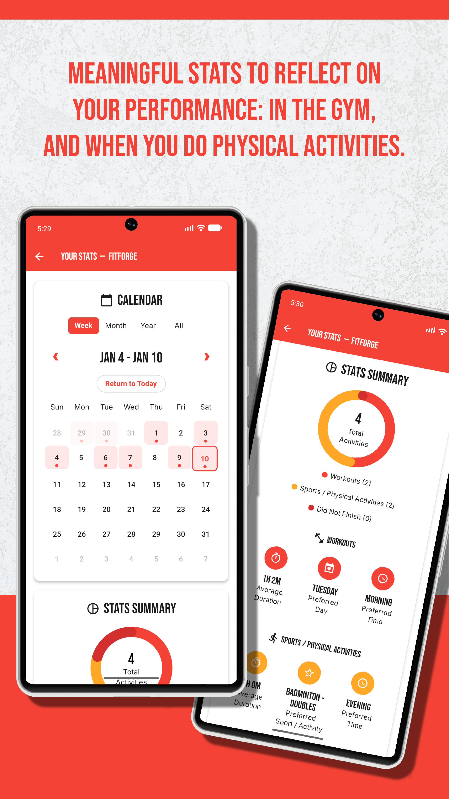
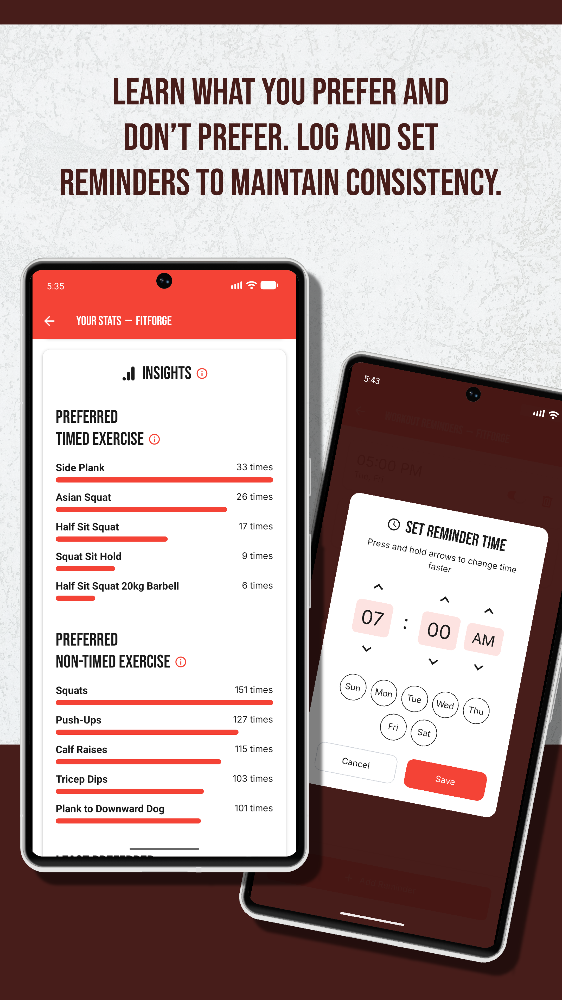

# FitForge (Public)

A personal workout tracking app for Android, built with React Native and Expo.

FitForge was born out of a simple frustration — keeping track of workout programs across pen and paper, notes apps, and spreadsheets was messy and unreliable. FitForge is a focused, privacy-first alternative: no ads, no account required, all data stays on your device.

Currently in closed testing on the Google Play Store.

---

## Become a Tester:
1) Sign up on this Google Form: https://docs.google.com/forms/d/e/1FAIpQLSd_p-KJLYu-1epsBpEU0PpgoCVXB74wv0tWOJTQ4OygKZBhTQ/viewform?usp=send_form
2) I’ll add you to the Closed Testing list.
3) You’ll get access to FitForge via the Google Play Store.

Note: You’ll need a Gmail account to participate. Your email will only be used for app access!

Thanks for supporting a hobby project! 😄

---

## Screenshots 

| Home | Workout Session | Finish Screen |
|------|----------------|---------------|
|  |  |  |

| Pre-made Workouts | Stats & Calendar | Insights |
|-------------------|-----------------|---------|
|  |  |  |

---

## Features

**Workout Management**
- Create custom workout programs with exercises, sets, reps, weight, and rest timers
- Organise workouts into folders
- Archive, restore, and version past workouts — never lose a program again
- Pre-made workouts included for quick starts

**Active Session**
- Guided workout session mode — one exercise at a time, rep counter, set tracking
- Timed exercise support with configurable break times
- Skip exercise, quit session options

**Notes & Sharing**
- Attach personal notes, reference links, and an image gallery to any workout
- Share workouts via QR code

**Stats & Insights**
- Calendar view (week, month, year, all-time)
- Stats summary — total activities, workout vs sport breakdown, did-not-finish tracking
- Insights — preferred exercises ranked by frequency, preferred days and times
- Logs both gym workouts and sports/physical activities

**Reminders**
- Configurable workout reminders with day-of-week and time selection

**Privacy**
- No ads
- No account or sign-in required
- All data stored locally on device

---

## Tech Stack

| Layer | Technology |
|-------|-----------|
| Framework | React Native (Expo) |
| Build | EAS Build (cloud)^ |
| Distribution | Google Play Store (Android only) |
| CI/CD | GitHub Actions → EAS Build → Play Store internal track |
| Pre-commit | Lefthook — gitleaks secret scanning, build number auto-increment |
| Testing | Jest — unit tests for utility functions |
| i18n | Custom i18n — en-AU, en-GB, en-US |
| Design | Custom design system inspired by Material Design |

^FitForge started with iOS in mind. Once the Apple Developer Program cost ruled out iOS distribution, I dropped to Android-only and EAS became the obvious choice — purpose-built for Expo, handles Play Store submission, no local toolchain to maintain.

---

## CI/CD Pipeline

Defined in `.github/workflows/android-release.yml`.

Three-job chain on version tag push (`v*`):

```
test → build → submit
```

- **test** — runs Jest unit test suite
- **build** — EAS Build cloud build targeting production profile, produces `.aab` artifact
- **submit** — submits to Play Store internal track via EAS Submit using Google Service Account (least-privilege permissions)

Actions pinned to immutable commit SHAs. `permissions: contents: read` set at workflow level. Secret scanning via `gitleaks` on every commit via Lefthook pre-commit hook.

---

## Project Structure

```
├── .github/workflows/     # GitHub Actions CI/CD pipeline
├── assets/                # App icons, splash screen, sounds
├── scripts/               # Build utilities (auto build number)
├── src/
│   ├── components/        # Shared UI components
│   │   └── design-system/ # Button, Typography, FAB, DonutChart, etc.
│   ├── constants/         # App constants, version
│   ├── context/           # React context (ThemeContext)
│   ├── hooks/             # Custom hooks
│   ├── i18n/              # Internationalisation (en-AU, en-GB, en-US)
│   ├── navigation/        # React Navigation root navigator
│   ├── screens/           # App screens
│   ├── theme/             # Colors, typography, spacing, elevation
│   └── utils/
│       └── __tests__/     # Jest unit tests
├── App.js                 # Entry point
├── app.config.js          # Expo config
├── eas.json               # EAS Build profiles
├── lefthook.yml           # Git hooks config
└── FITFORGE_PRIVACY_POLICY.md
```

---

## Testing

```bash
npm test
```

Jest unit tests located in `src/utils/__tests__/`.

---

## Status

| Item | Status |
|------|--------|
| Android build | ✅ Stable |
| Play Store | 🟡 Closed testing |
| iOS | Tested and working — not released (Apple Developer Program fee not justified for a hobby app) |

---

*Built by Alex Chuc*
